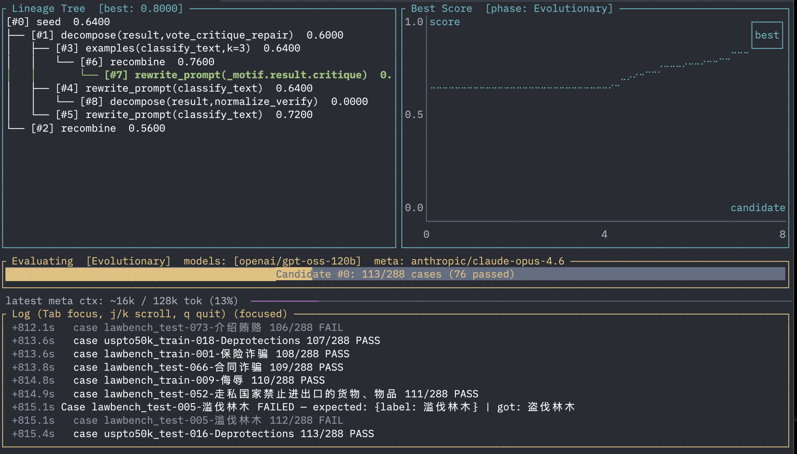

# Scaffold

A typed DSL that compiles to a single binary for writing and automatically optimizing LLM pipelines.

Define a pipeline as a typed directed graph, point it at a dataset, and the optimizer searches over prompt rewrites and graph topology to maximize your score. On a 247-class classification benchmark, it started from a single LLM call and discovered a [5-step pipeline](examples/text_classification_merged.text_classify.best.scaffold) scoring 77.1% — shortlist, select, normalize, critique, deterministic repair.



## Quick Start

Write a `.scaffold` file:

```scaffold
node classify: prompt {
    in: { text: string, labels: string }
    out: string
    template: "Classify this text:\n\n{{text}}\n\nLabels: {{labels}}"
    model: "openai/gpt-5.4"
}

graph classify_graph {
    in: { text: string, labels: string }
    out: string
    step result = classify(text: input.text, labels: input.labels)
    emit result
}

objective improve {
    graph: classify_graph
    dataset: file("data/train.jsonl")
    checker correct { output == expected.label }
    metric accuracy { checker: correct }
    score: accuracy
    topology { max_nodes: 8 target_score: 0.9 }
}
```

Run the optimizer:

```bash
scaffold optimize example.scaffold \
    --objective improve \
    --meta-model anthropic/claude-sonnet-4-5-20250929 \
    --max-candidates 10 \
    --concurrency 8 \
    --live
```

The optimizer evaluates the seed graph, sweeps tunable parameters, then runs evolutionary search — a meta-agent proposes typed mutations, the runtime validates each candidate against the type system, and evaluates it on your dataset. The best pipeline is written as a standalone `.scaffold` file.

## What the Optimizer Does

The meta-agent has 18 mutation types across three categories:

- **Content**: rewrite prompts, system prompts, shell commands, tool specs
- **Structural**: insert/remove steps, add verify gates, retry loops, parallel fan-out
- **Decomposition**: apply motifs from a library of 6 graph transformations

**Motifs** are reusable patterns triggered by failure analysis:

| Motif | What it does |
|-------|-------------|
| ShortlistSelect | Narrow candidates → select → normalize |
| VoteCritiqueRepair | Propose → critique → deterministic repair gate |
| NormalizeVerify | Raw output → format normalization |
| GenerateValidateRefine | Generate → tool validation → refine from feedback |
| RouterExpert | Route by domain → specialized handler |
| RetrieveDecide | Extract facts → decide from evidence |

Every candidate is a valid typed graph — verified before evaluation, semantically deduplicated. The meta-agent sees ~4-8KB of structured context per step: failure clusters, step-transition attribution, motif suggestions. Not raw logs.

## Install

```bash
cargo install --path crates/scaffold-cli
```

Compiles to a single binary. Requires `OPENROUTER_API_KEY` in environment.

## CLI

```
scaffold check FILE                        # parse + type check + verify
scaffold run FILE --graph G --input JSON   # execute a graph
scaffold optimize FILE --objective O       # run optimizer
```

## Crates

| Crate | What |
|-------|------|
| `scaffold-syntax` | Lexer, parser |
| `scaffold-types` | Type checker |
| `scaffold-verify` | Static verification |
| `scaffold-ir` | IR types and lowering |
| `scaffold-runtime` | Executor, optimizer, meta-agent, LLM providers |
| `scaffold-cli` | CLI binary |

## Docs

See [`docs/dsl-reference.md`](docs/dsl-reference.md) for full DSL syntax and optimization reference.
